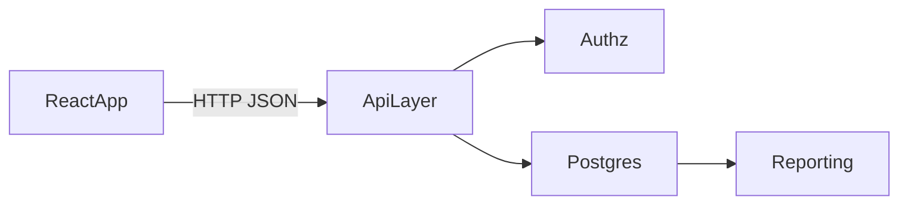

# PostgreSQL Migration Plan

## Current State (what we preserve)

- Data is currently pulled/pushed as one document via `fetch(CLOUD_API_URL)` in [/Users/itayhar-shuv/Documents/GitRepos/freegull-flow/store.tsx](/Users/itayhar-shuv/Documents/GitRepos/freegull-flow/store.tsx).
- Domain model is already well defined in [/Users/itayhar-shuv/Documents/GitRepos/freegull-flow/types.ts](/Users/itayhar-shuv/Documents/GitRepos/freegull-flow/types.ts), which we use as the source of truth for table design.

## Target Architecture

- Keep the React app as-is conceptually, but replace blob sync calls with resource endpoints.
- Add a backend API layer (Node/Express or Fastify) for validation, auth/roles, and transaction-safe writes.
- Move from a single shared document to relational tables with foreign keys and indexes.

## Initial SQL Schema (v1)

- `clubs` (club metadata/settings).
- `users` (employee records, role, flags, banking + 101 form metadata).
- `user_certifications` (many-to-many for `User.certifications`).
- `shifts`, `shift_bonuses`, `active_shifts` (separate active/in-progress from closed history).
- `lessons` (including optional card deposit JSON or separate card table).
- `rentals`.
- `tasks`, `task_assignees` (because `assignedTo` is array).
- `leads`.
- `availability` with unique key `(user_id, date)`.
- `confirmed_shifts`.
- `sea_events`, `event_boats`, `event_participants`.
- `whatsapp_templates`.
- `knowledge_files`.
- `club_rental_items` and optional `club_rental_statuses` (replacing string arrays).

## Data Modeling Decisions

- Prefer normalized tables for queryability and payroll/reporting.
- Use enum or constrained text for statuses (`lead`, `task`, `rental payment`, etc.).
- Use `timestamptz` for system timestamps and ISO date/time split only where business logic requires it.
- Store sensitive card data with a tokenized approach (or encrypted columns) instead of plain fields.
- Keep `club_id` as partitioning key across business tables for multi-club safety.

## Migration Sequence

1. Create DB schema + migrations.
2. Build API endpoints matching current store actions (`addUser`, `addShift`, `updateLesson`, etc.).
3. One-time import script: read existing blob JSON and upsert into SQL tables.
4. Switch frontend sync from blob polling to API reads/writes (module-by-module or feature-flagged).
5. Add optimistic UI + server conflict rules.
6. Decommission blob endpoint after verification window.

## API Surface (first pass)

- `GET/PUT /clubs/:clubId/settings`
- CRUD for `/users`, `/shifts`, `/lessons`, `/rentals`, `/tasks`, `/leads`, `/availability`, `/events`, `/templates`, `/knowledge-files`
- Specialized endpoints for actions: `POST /shifts/:id/close`, `POST /events/:id/archive`, etc.

## Rollout + Safety

- Dual-read period (optional): compare API response vs blob-derived state during staging.
- Add backups + point-in-time recovery.
- Add integration tests for critical flows: login, shift open/close, lesson scheduling, task assignment, event ops.
- Add DB constraints and transactions to prevent partial writes.

## Deliverables

- ERD + SQL migrations.
- Backend API with validation and auth middleware.
- Data import script from current blob payload.
- Frontend store refactor to API client.
- Smoke/integration test checklist.

