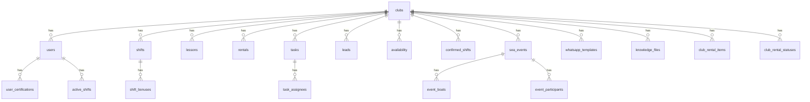

# PostgreSQL Schema

This schema maps the frontend domain types in `types.ts` to normalized relational tables.

## ERD (v1)

## Notes

- `club_id` is present across business tables to support multi-club isolation.
- `shifts.break_minutes` stores the total break time for a closed shift in whole minutes.
- `rentals.overdue_minutes` stores extra minutes beyond the planned rental duration when applicable.
- Join tables normalize arrays from the current state model:
  - `user_certifications`
  - `task_assignees`
  - `club_rental_items`
  - `club_rental_statuses`
- `active_shifts.payload` is JSONB because the active shift in the frontend can be partial.
- Raw card data is being removed from the schema; future deposit flows must keep only provider references and masked display fields.
